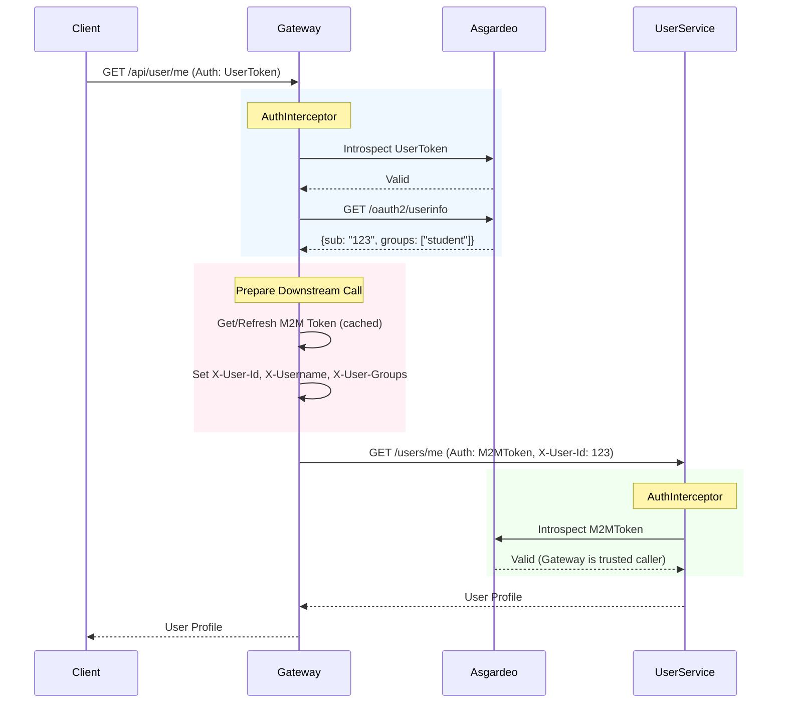

# Smart Campus Resource Management Platform

> An intelligent, AI-powered microservices platform for optimizing campus resource allocation — built with **Ballerina**, **Apache Kafka**, **Pinecone**, and **Asgardeo**.

---

## Table of Contents

- [Overview](#overview)
- [Architecture](#architecture)
  - [High-Level Diagram](#high-level-diagram)
  - [Service Breakdown](#service-breakdown)
- [Technology Stack](#technology-stack)
- [Services](#services)
  - [Gateway Service](#1-gateway-service-port-9090)
  - [User Service](#2-user-service-port-9095)
  - [Resource Service](#3-resource-service-port-9093)
  - [Booking Service](#4-booking-service-port-9094)
  - [AI Service](#5-ai-service-port-9096)
  - [Notification Service](#6-notification-service-port-9091)
- [Security Architecture](#security-architecture)
  - [Authentication Flow](#authentication-flow)
  - [Token Exchange Pattern](#token-exchange-pattern)
  - [RBAC Model](#rbac-model)
- [Data Layer](#data-layer)
- [Event-Driven Architecture](#event-driven-architecture)
- [Observability](#observability)
- [Getting Started](#getting-started)
  - [Prerequisites](#prerequisites)
  - [Development Mode (Recommended)](#development-mode-recommended)
  - [Full Docker Stack](#full-docker-stack)
  - [Configuration](#configuration)
- [API Reference](#api-reference)
- [Project Structure](#project-structure)

---

## Overview

The **Smart Campus Resource Management Platform** is a competition-grade microservices system designed to optimize the allocation of campus resources — lecture halls, computer labs, meeting rooms, equipment — using AI, real-time event streaming, and a secure identity-aware gateway.

**Key Highlights:**
- 🤖 **AI-Powered Recommendations** via Pinecone vector database for usage-pattern-based suggestions
- ⚡ **Event-Driven Architecture** with Apache Kafka for real-time notifications and audit trails
- 🔐 **Zero-Trust Security** with Asgardeo OAuth2, M2M token exchange, and group-based RBAC
- 📊 **Full Observability** stack using Prometheus, Grafana, and Jaeger distributed tracing
- 🐳 **Fully Containerized** — run the entire stack with a single `docker-compose` command
- 🌐 **Built in Ballerina** — showcasing advanced capabilities of the language

---

## Architecture

### High-Level Diagram

```
┌──────────────────────────────────────────────────────────────────┐
│                       Client Applications                        │
│                 (Web App / Mobile / Third-party)                 │
└──────────────────────────┬───────────────────────────────────────┘
                           │ HTTPS
                           ▼
┌──────────────────────────────────────────────────────────────────┐
│                  Gateway Service  (Port 9090)                    │
│   ┌──────────────────────────────────────────────────────────┐   │
│   │  AuthInterceptor → JWT Validation (Asgardeo)             │   │
│   │  RBAC Enforcement → Group-based Campus Authorization     │   │
│   │  Request Router  → Per-path service forwarding           │   │
│   │  M2M Token Cache → Secure service-to-service calls       │   │
│   └──────────────────────────────────────────────────────────┘   │
└──────┬────────┬────────┬────────┬────────┬────────────────────── ┘
       │        │        │        │        │
       ▼        ▼        ▼        ▼        ▼
┌──────────┐ ┌──────────┐ ┌──────────┐ ┌──────────┐ ┌──────────┐
│  User    │ │Resource  │ │ Booking  │ │    AI    │ │Notif.    │
│  Svc     │ │  Svc     │ │   Svc    │ │  Svc     │ │  Svc     │
│ :9095    │ │ :9093    │ │  :9094   │ │ :9096    │ │ :9091    │
└────┬─────┘ └────┬─────┘ └────┬─────┘ └────┬─────┘ └────┬─────┘
     │             │            │             │             │
     └─────────────┴────────────┼─────────────┘             │
                                ▼                            │
             ┌──────────────────────────────────┐           │
             │       Apache Kafka (Port 9092)   │◄──────────┘
             │  Topics: user-events,            │
             │  booking-events, resource-events │
             │  notification-events, audit-events│
             └──────────────────────────────────┘
                                │
                                ▼
┌──────────────────────────────────────────────────────────────────┐
│                          Data Layer                              │
│  ┌─────────────────┐  ┌──────────────────┐  ┌────────────────┐  │
│  │  MySQL :3306    │  │  Redis :6379     │  │  Pinecone      │  │
│  │  Users, Resources│  │  Sessions, Tokens│  │  Vector DB     │  │
│  │  Bookings,      │  │  Rate Limits,   │  │  AI Embeddings │  │
│  │  Notifications  │  │  Availability   │  │  ML Patterns   │  │
│  └─────────────────┘  └──────────────────┘  └────────────────┘  │
└──────────────────────────────────────────────────────────────────┘
                                │
                                ▼
┌──────────────────────────────────────────────────────────────────┐
│                       Observability Stack                        │
│   Prometheus (Metrics)  ·  Grafana (Dashboards)  ·  Jaeger      │
└──────────────────────────────────────────────────────────────────┘
```

### Service Breakdown

| Service              | Port | Role                                            |
|----------------------|------|-------------------------------------------------|
| `gateway-service`    | 9090 | API Gateway — auth, routing, rate limiting      |
| `user-service`       | 9095 | User management, OAuth2, JWT, profiles          |
| `resource-service`   | 9093 | Campus resource inventory & availability        |
| `booking-service`    | 9094 | Booking lifecycle, conflict detection, waitlists|
| `ai-service`         | 9096 | AI recommendations via Pinecone (Vector DB)     |
| `notification-service`| 9091| Email notifications, Kafka consumer             |

---

## Technology Stack

| Category           | Technology                               |
|--------------------|------------------------------------------|
| **Language**       | [Ballerina](https://ballerina.io/)       |
| **Database**       | MySQL 8.0 (relational data)              |
| **Cache**          | Redis (sessions, tokens, rate limits)    |
| **AI / Vector DB** | Pinecone (booking pattern embeddings)    |
| **Message Broker** | Apache Kafka (Confluent Platform 7.3)    |
| **Auth / IAM**     | Asgardeo (OAuth2 / OIDC / JWT)           |
| **Observability**  | Prometheus · Grafana · Jaeger            |
| **Containerization**| Docker · Docker Compose                 |

---

## Services

### 1. Gateway Service (Port 9090)

The single entry point for all client traffic. It enforces security and routes requests to the appropriate downstream microservice.

**Responsibilities:**
- Validate incoming OAuth2 JWT tokens via Asgardeo token introspection
- Extract user context (`userId`, `username`, `groups`) from `/oauth2/userinfo`
- Cache user info and M2M tokens in Redis to reduce Asgardeo round-trips
- Enforce campus RBAC: path-based access rules per user group
- Generate M2M tokens (Client Credentials) for secure service-to-service calls
- Forward requests with `X-User-Id`, `X-Username`, `X-User-Groups`, and `Authorization: Bearer <M2M_TOKEN>` headers

**Key Modules:**
- `modules/auth/auth.bal` — `AuthInterceptor` for JWT validation & RBAC
- `modules/auth/utils.bal` — `hasCampusAccess()`, `hasGroupAccess()` authorization logic
- `service.bal` — Route definitions and downstream forwarding

---

### 2. User Service (Port 9095)

Manages campus user identities, profiles, and authentication integration.

**Key Features:**
- Campus user registration with university email verification (via Asgardeo)
- OAuth2 login with role-based JWT (`student` / `staff` / `admin`)
- Profile management with department and preferences
- M2M token validation for all incoming requests (zero-trust)

**Database Schema (key table):**
```sql
CREATE TABLE users (
    id          VARCHAR(100) PRIMARY KEY,
    username    VARCHAR(50) UNIQUE,
    email       VARCHAR(100) UNIQUE,
    role        ENUM('student', 'staff', 'admin') DEFAULT 'student',
    department  VARCHAR(100),
    student_id  VARCHAR(20),
    is_verified BOOLEAN DEFAULT FALSE,
    is_active   BOOLEAN DEFAULT TRUE,
    created_at  TIMESTAMP,
    last_login  TIMESTAMP
);
```

---

### 3. Resource Service (Port 9093)

Manages the catalogue of bookable campus resources and tracks their real-time availability.

**Key Features:**
- CRUD for lecture halls, computer labs, meeting rooms, equipment, vehicles
- Real-time availability status (`available`, `reserved`, `maintenance`, `unavailable`)
- Feature metadata (AV equipment, accessibility, software, capacity)
- Multi-building / multi-campus location support
- Maintenance scheduling integration

**Database Schema (key table):**
```sql
CREATE TABLE resources (
    id          VARCHAR(100) PRIMARY KEY,
    name        VARCHAR(255) NOT NULL,
    type        ENUM('lecture_hall','computer_lab','meeting_room','study_room','equipment','vehicle'),
    capacity    INT DEFAULT 1,
    features    JSON,
    location    VARCHAR(255),
    building    VARCHAR(100),
    floor       VARCHAR(10),
    room_number VARCHAR(20),
    status      ENUM('available','maintenance','unavailable','reserved')
);
```

---

### 4. Booking Service (Port 9094)

The core business logic engine for resource reservation, conflict management, and scheduling.

**Key Features:**
- AI-assisted conflict detection: detects overlapping bookings instantly
- Automatic waitlist management with priority-based allocation
- Recurring booking support with pattern recognition
- Bulk booking operations for administrators
- Kafka event emission for every booking lifecycle state change

**Database Schema (key table):**
```sql
CREATE TABLE bookings (
    id              VARCHAR(100) PRIMARY KEY,
    user_id         VARCHAR(100),
    resource_id     VARCHAR(100),
    title           VARCHAR(255),
    start_time      TIMESTAMP,
    end_time        TIMESTAMP,
    status          ENUM('pending','confirmed','in_progress','completed','cancelled','no_show'),
    purpose         VARCHAR(100),
    attendees_count INT,
    FOREIGN KEY (user_id)     REFERENCES users(id),
    FOREIGN KEY (resource_id) REFERENCES resources(id)
);
```

---

### 5. AI Service (Port 9096)

⭐ **Innovation Highlight** — integrates Pinecone vector database for AI-powered intelligence.

**Key Features:**
- **Usage Pattern Analysis**: stores booking behavior as vector embeddings in Pinecone
- **Smart Recommendations**: suggests optimal resources and time slots based on past patterns and similarity matching
- **Predictive Analytics**: forecasts resource demand to help administrators plan capacity
- **Anomaly Detection**: identifies unusual usage spikes or potential scheduling conflicts
- **Continuous Learning**: embeddings are updated as new bookings occur

**Integration:**
```
Booking Event (Kafka) → AI Service → Pinecone Upsert (vector embedding)
Query Request         → AI Service → Pinecone Query  → Ranked Recommendations
```

---

### 6. Notification Service (Port 9091)

Handles all outbound email notifications triggered by campus booking events.

**Key Features:**
- Kafka consumer — listens on `booking-events`, `user-events`
- Professional HTML email templates (confirmation, reminder, cancellation, maintenance alert)
- Delivery status tracking and retry logic
- SMTP integration with university email systems

**Database Schema (key table):**
```sql
CREATE TABLE notifications (
    id           VARCHAR(100) PRIMARY KEY,
    user_id      VARCHAR(100),
    type         ENUM('booking_confirmation','booking_reminder','booking_cancelled','maintenance_alert','system_announcement'),
    channel      ENUM('email'),
    title        VARCHAR(255),
    message      TEXT,
    status       ENUM('pending','sent','delivered','failed'),
    scheduled_at TIMESTAMP,
    sent_at      TIMESTAMP,
    booking_id   VARCHAR(100)
);
```

---

## Security Architecture

### Authentication Flow

```
1. User authenticates with Asgardeo (OAuth2 / OIDC)
2. Asgardeo returns a signed JWT access token with user claims & groups
3. Client includes the token in: Authorization: Bearer <USER_TOKEN>
4. Gateway AuthInterceptor intercepts the request
5. Gateway calls Asgardeo /oauth2/introspect to validate the token
6. Gateway fetches user info from /oauth2/userinfo (cached in Redis, 10-min TTL)
7. Gateway extracts:  sub (userId), username, groups (campus roles)
8. Gateway checks group-based RBAC for the requested path
9. Gateway fetches (or generates) an M2M token via Client Credentials grant
10. Gateway forwards request with X-User-* headers and M2M Authorization token
11. Downstream service validates the M2M token (trusts the Gateway as caller)
12. Service uses X-User-Id from headers for business logic
```

### Token Exchange Pattern



### RBAC Model

Role claims are sourced from Asgardeo `groups` JWT claim. Multi-role users are supported (e.g., a user can be `staff` AND `admin`).

| Role      | Access                                                                 |
|-----------|------------------------------------------------------------------------|
| `admin`   | Full access — all endpoints including `/api/admin/*`                   |
| `staff`   | Resources, bookings, analytics, AI, notifications, user management     |
| `student` | Own profile, resource discovery, own bookings, AI recommendations      |

**Path-based Authorization (Gateway):**
```ballerina
isolated function hasGroupAccess(string group, string path) returns boolean {
    match group {
        "admin"|"Administrator"|"campus_admin" => { return true; }
        "staff"|"faculty" => {
            return path.startsWith("/api/user/") || path.startsWith("/api/resource/") ||
                   path.startsWith("/api/booking/") || path.startsWith("/api/analytics/") ||
                   path.startsWith("/api/ai/") || path.startsWith("/api/notification/");
        }
        "student" => {
            return path.startsWith("/api/user/me") || path.startsWith("/api/resource/") ||
                   path.startsWith("/api/booking/") || path.startsWith("/api/ai/recommend/") ||
                   path.startsWith("/api/notification/");
        }
        _ => { return false; }
    }
}
```

**Security Headers forwarded to all downstream services:**

| Header            | Value                               |
|-------------------|-------------------------------------|
| `X-User-Id`       | Asgardeo `sub` claim (UUID)         |
| `X-Username`      | University email / username         |
| `X-User-Groups`   | JSON array of campus roles          |
| `Authorization`   | `Bearer <M2M_TOKEN>` (not user JWT) |

---

## Data Layer

| Store          | Purpose                                              | Port  |
|----------------|------------------------------------------------------|-------|
| **MySQL 8.0**  | Persistent relational data (users, resources, bookings, notifications) | 3306 |
| **Redis**      | Token cache, session cache, rate-limit counters, availability cache | 6379 |
| **Pinecone**   | Vector embeddings for AI booking-pattern analysis and recommendations | Cloud |

Database initialization scripts are in `shared/sql/` and are automatically executed on first MySQL startup via Docker volume mount.

---

## Event-Driven Architecture

All inter-service async communication is handled via **Apache Kafka**.

| Topic                 | Producer(s)              | Consumer(s)              | Purpose                            |
|-----------------------|--------------------------|--------------------------|------------------------------------|
| `user-events`         | User Service             | AI, Notification         | Registration, login, profile change|
| `booking-events`      | Booking Service          | AI, Notification         | Booking lifecycle state changes    |
| `resource-events`     | Resource Service         | AI, Notification         | Resource status changes            |
| `notification-events` | All Services             | Notification Service     | Trigger email delivery             |
| `audit-events`        | Gateway, All Services    | —                        | Security & compliance audit trail  |
| `waitlist-events`     | Booking Service          | Booking, Notification    | Waitlist allocation events         |

**Kafka Infrastructure:**
- ZooKeeper: coordination
- Confluent Platform 7.3
- Consumer Groups for parallel processing
- Dead Letter Queues for unprocessable messages

---

## Observability

| Tool           | Purpose                                            |
|----------------|----------------------------------------------------|
| **Prometheus** | Collects metrics from Ballerina `observe` module   |
| **Grafana**    | Visual dashboards for resource utilization, booking rates, API latency |
| **Jaeger**     | Distributed request tracing with correlation IDs across all services   |

Ballerina's built-in `ballerina/observe` module exposes metrics automatically. Structured JSON logs include `correlationId` for end-to-end request tracing.

---

## Getting Started

### Prerequisites

- [Docker Desktop](https://www.docker.com/products/docker-desktop/) (for infrastructure)
- [Ballerina Swan Lake](https://ballerina.io/downloads/) (for local service development)
- An [Asgardeo](https://asgardeo.io/) organization with:
  - A **Client Application** (OAuth2 with PKCE)
  - An **M2M Application** (Client Credentials)
  - User groups: `admin`, `staff`, `student`

---

### Development Mode (Recommended)

Run **only infrastructure** (MySQL, Kafka, Redis) in Docker, and run Ballerina services locally for hot-reload development.

**Step 1: Start infrastructure**
```bash
cd services/
docker-compose -f docker-compose.dev.yml up -d
```

**Step 2: Configure each service**

Create/edit `Config.toml` in each service directory. Example for `user-service/Config.toml`:
```toml
[database]
host     = "localhost"
port     = 3306
username = "root"
password = "1111"
database = "finmate"

[kafka]
bootstrapServers = "localhost:9092"

[gateway_service.auth]
clientId          = "<your-asgardeo-client-id>"
clientSecret      = "<your-asgardeo-client-secret>"
M2MClientId       = "<your-m2m-client-id>"
M2MClientSecret   = "<your-m2m-client-secret>"
authProviderURL   = "https://api.asgardeo.io/t/<your-org>"
```

**Step 3: Run a service**
```bash
cd user-service/
bal run
```

Repeat for each service in separate terminals.

---

### Full Docker Stack

Run the **entire platform** (infrastructure + all microservices) with a single command:

```bash
cd services/
docker-compose up --build
```

**Service endpoints after startup:**

| Service              | URL                          |
|----------------------|------------------------------|
| Gateway              | http://localhost:9090        |
| User Service         | http://localhost:9095        |
| Resource Service     | http://localhost:9093        |
| Booking Service      | http://localhost:9094        |
| AI Service           | http://localhost:9096        |
| Notification Service | http://localhost:9091        |
| MySQL                | localhost:3306               |
| Redis                | localhost:6379               |
| Kafka                | localhost:9092               |

> **Note:** Each Ballerina service requires a `Config.toml` with secrets. These are not committed to source control — configure them before building Docker images.

---

### Configuration

Each service uses a `Config.toml` file for environment-specific configuration. The key sections are:

```toml
# Database (MySQL)
[database]
host     = "localhost"
port     = 3306
database = "finmate"
username = "root"
password = "1111"

# Kafka
[kafka]
bootstrapServers = "localhost:9092"
topics           = ["user-events", "booking-events"]

# Asgardeo (Gateway only)
[gateway_service.auth]
clientId        = "..."
clientSecret    = "..."
M2MClientId     = "..."
M2MClientSecret = "..."
authProviderURL = "https://api.asgardeo.io/t/<org>"

# Pinecone (AI Service only)
[pinecone]
apiKey      = "..."
environment = "..."
indexName   = "campus-embeddings"
```

---

## API Reference

All APIs are proxied through the Gateway at `http://localhost:9090/api/...`.

### User Service
| Method | Path                        | Access        | Description                     |
|--------|-----------------------------|---------------|---------------------------------|
| POST   | `/api/user/register`        | Public        | Register a new campus user      |
| POST   | `/api/user/login`           | Public        | Authenticate (returns JWT)      |
| GET    | `/api/user/verify`          | Public        | Verify university email         |
| GET    | `/api/user/me`              | student+      | Get current user profile        |
| PUT    | `/api/user/me`              | student+      | Update profile & preferences    |

### Resource Service
| Method | Path                               | Access    | Description                         |
|--------|------------------------------------|-----------|-------------------------------------|
| POST   | `/api/resource/resources`          | admin     | Create a new campus resource        |
| GET    | `/api/resource/resources`          | student+  | List resources with filters         |
| GET    | `/api/resource/resources/{id}`     | student+  | Get resource details                |
| PUT    | `/api/resource/resources/{id}`     | staff+    | Update resource details             |
| GET    | `/api/resource/resources/{id}/availability` | student+ | Check real-time availability |
| POST   | `/api/resource/resources/{id}/maintenance` | admin   | Schedule maintenance         |

### Booking Service
| Method | Path                           | Access    | Description                             |
|--------|--------------------------------|-----------|-----------------------------------------|
| POST   | `/api/booking/bookings`        | student+  | Create a booking (with conflict check)  |
| GET    | `/api/booking/bookings`        | student+  | List own bookings (admin: all)          |
| GET    | `/api/booking/bookings/{id}`   | student+  | Get booking details                     |
| PUT    | `/api/booking/bookings/{id}`   | student+  | Update a booking                        |
| DELETE | `/api/booking/bookings/{id}`   | student+  | Cancel a booking                        |
| POST   | `/api/booking/bookings/bulk`   | staff+    | Bulk create bookings                    |

### AI Service
| Method | Path                              | Access    | Description                              |
|--------|-----------------------------------|-----------|------------------------------------------|
| POST   | `/api/ai/recommend/resources`     | student+  | Get AI resource recommendations          |
| POST   | `/api/ai/recommend/times`         | student+  | Get optimal time slot suggestions        |
| GET    | `/api/ai/patterns/{userId}`       | staff+    | Get booking patterns for a user          |
| POST   | `/api/ai/predict/demand`          | admin     | Predict resource demand                  |
| GET    | `/api/ai/insights/usage`          | staff+    | Get usage optimization insights          |

---

## Project Structure

```
services/
├── gateway-service/          # API Gateway
│   ├── modules/auth/         # AuthInterceptor, RBAC utilities
│   └── service.bal           # Route definitions
├── user-service/             # User management & auth
├── resource-service/         # Resource catalogue & availability
├── booking-service/          # Booking engine
├── ai-service/               # Pinecone AI integration
├── notification-service/     # Email notifications (Kafka consumer)
├── analytic-service/         # Usage analytics
├── shared/
│   └── sql/                  # MySQL schema initialization scripts
├── docs/
│   ├── design.md             # Detailed system architecture design
│   ├── requirements.md       # Functional & non-functional requirements
│   ├── PROJECT_ANALYSIS.md   # Technical deep-dive & token exchange
│   ├── RBAC_IMPLEMENTATION.md# RBAC implementation guide
│   └── INTERVIEW_QNA.md      # Architecture Q&A for presentations
├── Dockerfile.ballerina      # Shared Ballerina Dockerfile
├── docker-compose.yml        # Full stack (infra + services)
└── docker-compose.dev.yml    # Infrastructure only (for local dev)
```

---

## Key Design Decisions

| Decision | Rationale |
|----------|-----------|
| **Ballerina** as the primary language | Native HTTP, SQL, Kafka, auth, and observability modules without boilerplate; cloud-native by design |
| **Asgardeo** as Identity Provider | Managed OAuth2/OIDC with built-in group management, university email domain support, and M2M flows |
| **M2M Token Exchange** at Gateway | Zero-trust: downstream services authenticate the Gateway, not the end user, preventing token relay attacks |
| **Pinecone** for AI recommendations | Purpose-built vector DB enables sub-second similarity search on booking embeddings at scale |
| **Kafka** for async communication | Decouples notification delivery from core booking flow; enables audit logging and replay capability |
| **Redis** for token caching | Eliminates repeated Asgardeo calls for each request — critical for <1s P99 latency target |

---

*For more details, see the [`docs/`](./docs/) directory.*
